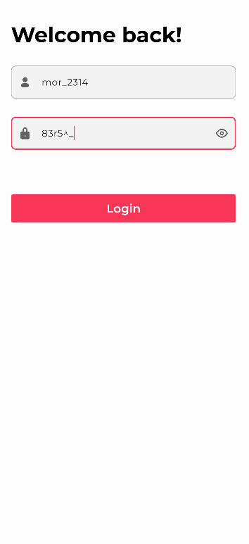
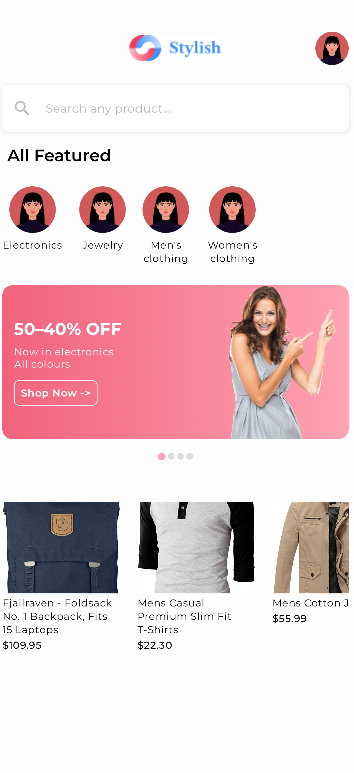
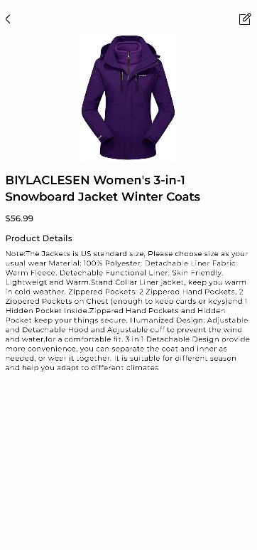

# Stylish

Stylish is a demo e-commerce app where users can browse and buy products. It is not a fully
functional app but a project using fake products from https://fakestoreapi.com/ to demonstrate 
clean architecture and technical skills in general.

You may use data from https://fakestoreapi.com/docs to login or quickly use these credentials (there
are others mentioned in the link).

**Username**: mor_2314  
**Password**: 83r5^_  

---

## Features

- **Clean Code Architecture and MVVM**: Implements layered architecture for better separation of
  concerns and MVVM in presentation layers.

- **Multi-Module Architecture**: Separation of layers mainly in presentation, domain and data
  sub-modules.

- **Jetpack Compose**: Used Jetpack Compose for the UI of the app.

- **Ktor for HTTP Requests**: For handling network and HTTP requests.

- **State Management**: Uses `StateFlow` and `State` objects to manage UI state and `Flow` for
  reacting to derived changes of state.

- **Local Data Storage**: `SharedPreferences` for storing data like user login
  data.

- **Hilt Dependency Injection**: Used Hilt for dependency management across modules.

- **Testing**: Includes Unit and UI testing with tools like:
    - `mockk` for stubbing behavior.
    - `Robolectric` for JVM-based UI tests.
    - An End-to-End instrumented test for the navigation of the whole demo.

---
## Screenshots

    

